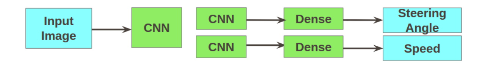

# AutonomousMachines
Student Research Project in University Of Hildesheim

### Summary 

Focus is End-to-End learning for steering angle prediction in self driving cars. Unlike object detection approach, end-to-end learning directly maps the input images to a driving action of steering angle and speed. In this approach the system automatically learns the internal representation of the necessary features required for making driving decision without explicit feature engineering. This type of systems optimizes the internal processes automatically and hence leads to a simpler, powerful and efficient system. More specifically we explore three different types of end-to-end learning approaches for steering angle prediction – CNN based single task architecture, CNN based multitask architecture and CNN+LSTM based architecture. In Multitask learning approach we learn related tasks of steering angle and speed simultaneously, belonging to the same domain. The idea is that the related tasks will help each other in getting better internal representation of the features. In CNN+LSTM based approach, we try to learn the internal feature using CNN but we try to exploit the time relatedness of these feature by using
recurrent layers (LSTM). We have done transfer learning as well as model tuning on already trained models to get the better convergence for our models. Along with this we also worked on other supporting modules like Object Detection, Object Distance Estimation, Lane Detection and Traffic Sign Detection that are trained on different publicly available datasets.

### Collaborator 's @ University of Hildesheim  
Abdul Rehman Liaqat   
Amir Javed   
Manish Mishra   
Raghavendran Tata   
Zafar Mahmood 